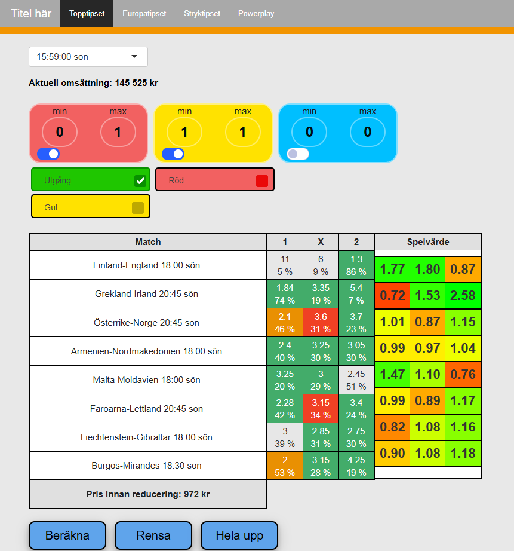
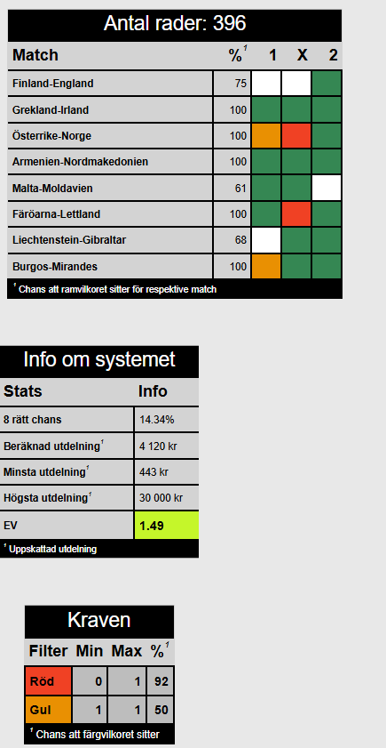

# SVS-Poolspel
Preview of Jesper Olsson's and my attempt to calculate the expected value from Svenska Spel's pool betting.
We worked in R Shiny to produce our program.

Svenska Spel "Topptipset" in R Shiny

The authors: *Jesper Olsson*, *William Wiik* & *The poet*

